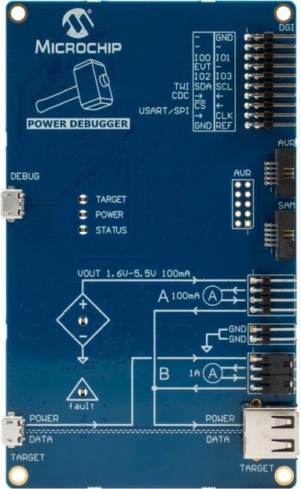
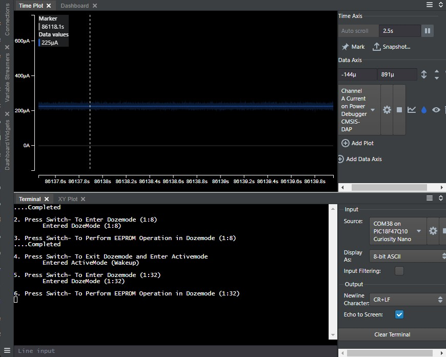
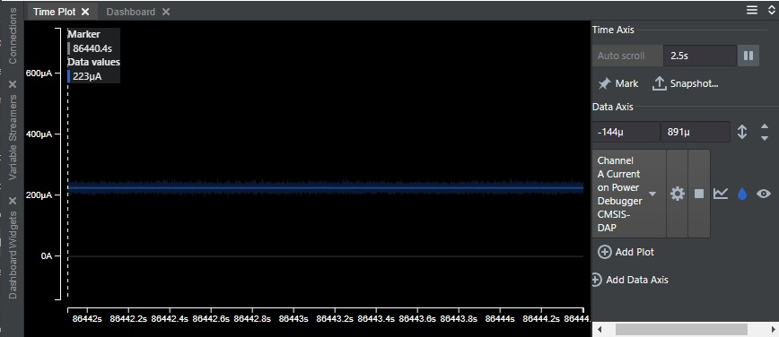

# Low Power Modes in PIC® Microcontrollers
# Introduction
 PIC Microcontroller Units (MCU)s feature variosu Power-Down modes that help to reduce average power consumption through effective management of CPU operations, clock signals, and peripherals. The Power-Down modes typically comprise of Doze, Idle, Sleep and Deep sleep modes. The PIC18-Q10 family of MCUs have three power down modes - Doze, Idle and Sleep. This example demonstrates how to acheive low power consumption by utilizing Doze, Idle, and Sleep modes.    

 # Useful Links
- [Low-Power Design Tips & Tricks](https://www.microchip.com/DS01146)
- [TB3144: Doze, Idle and PMD Features of 8-Bit PIC® Microcontrollers](https://www.microchip.com/DS90003144)
- [Low Power Modes on PIC® Microcontrollers - YouTube](https://youtu.be/4QdOuG0TZic)
- [PIC18-Q10 Product Family Page](https://www.microchip.com/design-centers/8-bit/pic-mcus/device-selection/pic18f-q10-product-family)
- [PIC18F47Q10 Data Sheet](https://www.microchip.com/DS40002043)
- [PIC18F47Q10 Code Examples on GitHub](https://github.com/microchip-pic-avr-examples?q=pic18f47q10)

# Power down modes - Theory
This section briefly discusses each of the Power-Down mode available on PIC18-Q10 devices.

## Doze mode
 In Doze mode, CPU and memory operations are affected, but the peripheral clocks continue to run. Doze mode allows power saving by reducing CPU clock instruction cycles, while leaving the peripheral clock unchanged. In Doze mode the CPU executes only one instruction cycle out of every N-cycles as defined by the DOZE [2:0] bits in the `CPUDOZE` register. For example, if DOZE [2:0] = 001, the instruction cycle ratio is 1:4. The CPU and memory execute for one instruction cycle and then lay idle for three instruction cycles. During the unused cycles, the peripherals continue to operate at the system clock speed.

Steps to enter Doze mode:
1. `CPUDOZEbits.DOZEN = 1;        // Doze enable bit (DOZEN) must be set, to enter the Doze mode`
2. `CPUDOZEbits.DOZE = dozeRatio; //Select the ratio of CPU clock instruction cycle to Peripheral clock instruction cycle in DOZE register`
3. `CPUDOZEbits.ROI = 1; //Set the Recover-On-Interrupt bit to come out of the Doze mode, when interrupt occurs`

## Idle mode
 In Idle mode, CPU and Memory operations are halted, but the peripheral clocks continue to run. Device is put into Idle mode by executing the `SLEEP` instruction when the Idle enable bit is set.

## Sleep mode 
Sleep mode turns off the system clock. The CPU and all peripherals requiring the system clock will cease operation. The contents of the memory and registers are maintained in Sleep mode. The device is put into Sleep mode by executing the `SLEEP` instruction, when the Idle enable bit is clear.

# Clocks
This section discusses the System clock, CPU clock, and Peripheral clock (Refer to Table 1).

## System Clock
 The System clock, designated as FOSC, is the main clock which can be supplied from external oscillators, quartz crystal resonators, ceramic resonators, or Resistor-Capacitor (RC) circuits. Additionally, the system clock source can be supplied from one of two internal oscillators. The Oscillator module can be configured to select one of the clock sources.

## CPU Clock
 The instruction clock, or CPU clock, is derived from the system clock or FOSC through a divider to deliver an instruction clock of FOSC/4 (1/4 the oscillator speed). This is done to allow the fetch and execute pipeline in the architecture to execute one assembly instruction per instruction clock cycle (except for branches and goto's which execute in two). The CPU clock is supplied to the CPU and memory to perform CPU and memory Operations in the application.

## Peripheral Clock
 Each Peripheral on the device will have its own clock options which usually include FOSC, FOSC/4, the internal low-frequency oscillator (LFINTOSC), and the output of other peripherals. Refer to the device data sheet for the specifics of each peripheral. 

*Table 1: Clock details in Power Down modes*

## Peripheral Module Disable

The Peripheral Module Disable (PMD) feature provides the ability to disable a peripheral by stopping all clock sources supplied to that module. A peripheral can be disabled by setting the corresponding peripheral disable bit in the PMDx register.  All the peripherals are enabled by default. To reduce overall power consumption, the user can disable unused modules/Peripherals. Refer to the device data sheet for more details about the PMD register

# Demo Description

*Figure 1: Block diagram of application demo*  

  In this demo,
* The PIC18F47Q10 Curiosity Nano and Power debugger boards from Microchip are used to demonstrate Power-Down modes configuration and to measure MCU power consumption.
* The on-board mechanical switch (SW0) of the PIC18F47Q10 Curiosity Nano board is used to invoke Power-Down modes or to wake up the MCU from power down modes which happens sequentially at each switch press event.
* The MCU operating mode (i.e. Active mode/Doze mode/Idle mode/Sleep mode) information is transmitted to the terminal window of Data visualizer tool, through the virtual COM port of the Curiosity nano board.
* The Power Debugger board measures the power consumption of the PIC18F47Q10 MCU and displays the measurement using MPLAB Data visualizer.
* The onboard LED (LED0) is used as an indication while the MCU wakes up from any of the power down modes and enters the active mode.
* On start-up, the MCU operates in Active mode. When SW0 is pressed, the MCU performs EEPROM write and read operations. While this is happening, the power consumption of the device can be viewed in Data Visualizer. 
* When SW0 is pressed again, the MCU enters Doze mode and performs the EEPROM operation. In this mode CPU operates at reduced clock instruction cycles compared to the active mode. The MCU remains in Doze mode until SW0 is pressed again, after which the MCU will wake up from Doze mode and enter Active mode. LED0 will then turn on indicating the MCU is in active mode.
* When SW0 is pressed again, the MCU will enter Idle mode. The MCU will remain in Idle mode until SW0 is pressed and the MCU switches to Active mode. LED0 will turn on to indicate the device is in Active mode 
* When SW0 is pressed again, the MCU enters Sleep mode. The MCU continues in Sleep mode until a switch press event is detected. Upon a switch press event, the MCU wake up from the Sleep mode and enters Active mode. LED0 will be on to indicate the device is in Active mode. 

# Hardware used
**[PIC18F47Q10 Curiosity Nano board](https://www.microchip.com/Developmenttools/ProductDetails/DM182029)**

With full program and debug capabilities, the PIC18F47Q10 Curiosity Nano evaluation kit offers complete support for the new design. With the award-winning MPLAB X integrated development platform and MPLAB Code Configurator (MCC), the kit provides access to the Intelligent analog and Core Independent Peripherals on the PIC18F47Q10. Figure 2 shows PIC18F47Q10 Curiosity Nano board. For more details refer to the [PIC18F47Q10 Curiosity Nano Hardware user guide](https://www.microchip.com/DS40002103)

*Figure 2: PIC18F47Q10 Curiosity Nano board*

**[Power Debugger](https://www.microchip.com/developmenttools/ProductDetails/atpowerdebugger)**    

Power Debugger is a powerful development tool used for debugging and programming AVR and SAM MCUs. The power debugger contains two channels for measuring power consumption, one channel is used for High-precision low-current measurement, while the second channel is used for Low-precision high-current measurement. In this example, Power Debugger with Channel A (High precision low-current measurement) is used in order to measure current consumption of the PIC18F47Q10 MCU and to transmit the measured data to Data Visualizer. For more details refer to the [Power Debugger User Guide](https://www.microchip.com/42696). Figure 3 shows the Power debugger.

*Figure 3: Power Debugger*

*Note: In Curiosity Nano board, on-board level shifters will draw a current of 20 μA. To know the power consumption of PIC18F47Q10 MCU in each power down modes, subtract 20 μA from actual power consumption.*

# Software Tools:
Microchip’s free MPLAB X IDE, compiler and MPLAB Code Configurator (MCC) graphical code generator are used throughout the firmware development. Following are the tool versions used for this demo application:
* [MPLAB® X IDE v6.20](https://www.microchip.com/mplab/mplab-x-ide)
* [XC8 Compiler v3.00](https://www.microchip.com/mplab/compilers)
* [MPLAB® Code Configurator (MCC) v5.7.1](https://www.microchip.com/mplab/mplab-code-configurator)
* [Microchip PIC18F-Q Series Device Support 1.26.442](https://packs.download.microchip.com/)

*Note: For running the demo, the installed tool versions should be same or later. This example is not tested with previous versions.*

**MPLAB Data Visualizer**

 MPLAB Data Visualizer is a plugin available in MPLAB X used to process and visualize data. Data Visualizer can receive data from various sources such as the Embedded Debugger Data Gateway Interface (DGI) and COM ports. Data Visualizer is made up of several modules such as Graph, Terminal, Power debugging, Custom dashboard etc. In this example, Data Visualizer is used to plot power consumption data received from the Power Debugger. The terminal window is used to display serial data transmitted by the PIC18F47Q10 MCU to indicate the current Power-Down mode. 

# Demo realization
## Peripherals Configuration using MCC

**Clock Control**

- Clock Source: HFINTOSC
- HF Internal Clock: 1_MHz
- Clock Divider: 1

**Configuration Bits**

- Fail-Safe Clock Monitor Enable: Disabled
- External Oscillator Mode Selection: Oscillator not enabled
- Brown-out Reset Enable: Brown-out Reset disabled
- WDT Operating Mode: WDT Disabled

**UART**

- UART PLIB Selector: EUSART2
- Requested Baudrate: 9600
- Data Size: 8
- Flow Control Mode: None
- Redirect Printf to UART: Enabled

**NVM**

- Generate Flash APIs: Enabled 
- Generate EEPROM APIs: Enabled

**Pins**

| Pin Name | Module  | Function | Direction | Custom Name | Weak Pullup |
| -------- | ------- | -------- | --------- | ----------- | ----------- | 
|   RD0    | EUSART2 |   TX2    |   output  |    IO_RD0   |     No      |
|   RB0    | Pins    |   GPIO   |   input   |    IO_RB0   |     Yes     |
|   RE2    | Pins    |   GPIO   |   input   |    IO_RE2   |     Yes     | 
|   RE0    | Pins    |   GPIO   |   output  |    LED      |     No      |

# Hardware Setup
There are two methods for Hardware connection.

### First Method:
1. Short the pins RE2 and RB0 using the jumper
2. Cut the Target Power strap on PIC18F47Q10 Curiosity nano board to measure the power consumption of the MCU (refer to PIC18F47Q10 Curiosity Nano Hardware User Guide)
3. Setup the hardware connections as shown in figure 4:
   - Short the Variable Supply voltage pin to the Channel A input pin of power debugger
   - Since Target Power strap is cut, power to the target MCU is suspended from USB. Power debugger is used as a source to supply power to the Curiosity Nano Board. Connect Channel A output of power debugger to the VTG pin of Curiosity nano board, which supplies power of 3.3V.

*Figure 4: Current measurement using power debugger hardware connections*

4. Power debugger has an on-board voltage supply which can provide up to 1.6V to 5.5V from the USB DEBUG connector. To supply 3.3V to the PIC18F47Q10 MCU follow the steps below:
    -In the Data Visualizer tab, select **Power Debugger CMSIS-DAP**
    -Enable power interface by opening **Power Settings**. Enter 3300 in the Output Voltage in mV box.
    -Click anywhere outside the Power settings pop-up to save the settings

*Figure 5: Power Configuration window*

### Second Method:
1. Short the pins RE2 and RB0 using the jumper.
2. Cut the Power Target strap on PIC18F47Q10 Curiosity nano board and solder two wires on that VTG strap
3. Connect the two soldered wires to the Channel A of the power debugger in series to measure current as shown in figure 13.

*Figure 6: Current measurement using power debugger hardware connections*

4. Setup the hardware, as shown in figure 6.

**(Steps from 5 to 10 are same for the two methods of hardware connection)**

5. Power the Curiosity nano board from PC machine, by connecting micro USB cable between PC USB port and micro USB port of the Curiosity nano board.

6. Similarly, power the Power Debugger board from PC, by connecting micro USB cable between PC USB port and micro USB port (named as DEBUG) of the power debugger board.

7. The Curiosity Nano board should appear as a Mass Storage Device after connecting to the PC.

8. Program the MCU by clicking “Make and Program Device” icon on MPLAB X IDE.

### Steps to plot power in Data Visualizer
1. Open Data Visualizer by clicking the Data Visualizer icon in MPLAB X
2. Under the Data Visualizer tab, click on the connections on the left side of the pane
3. Expand the option "Power Debugger CMSIS-DAP"
4. Click the play button next to "Power" 

*Figure 7: Start Data visualizer and start plotting power*

### Steps to open Terminal window in Data Visualizer
1. In the Data Visualizer window, click on "Connections" 
2. Expand the option "PIC18F47Q10 Curiosity Nano"
3. Mouse over the COM port listed under "PIC18F47Q10 Curiosity Nano"
4. Click on the terminal icon

*Figure 8: Open terminal window in Data visualizer*

# Demo Operation

The following figures show the average current consumption of the Curiosity nano board in different power down modes of MCU. The power consumption values discussed in this document are observed with mentioned hardware setup as previously described.

**Active mode:**
- After power up, the MCU enters the Active mode
- Before each switch press, instructions are mentioned to the user on terminal window.  E.g.  Press Switch- To perform EEPROM Operation in Active mode.
- When the Curiosity Nano board is loaded with the firmware, following waveform (Refer Fig 9) is observed and instructions are provided on terminal window to the user for further operations
- Observe the average current consumption of the MCU in Active mode is 255 uA

*Figure 9: Current Consumption in Active mode*

**Active mode – EEPROM Operation**
- Press Switch (SW0) to perform EEPROM Operation in Active mode and user needs to wait until the “Completed” text is displayed on terminal window, which indicates EEPROM Operation is completed.
- Observe the average current consumption during EEPROM Operation in Active mode is 916.8 μA  (Refer Fig 10).

*Figure 10: EEPROM Operation in Active mode*

- Observe the “Completed” text and next instruction to the user is displayed on terminal window (Refer Fig 11).

*Figure 11: Current Consumption and Terminal window in Active mode*

**Doze mode (Doze ratio=1:8)**
* Press Switch (SW0) to enter Doze mode with Doze ratio 1:8 and observe the text” Entered Doze mode 1:8” is displayed on terminal window after switch press and wait for the next instruction to be displayed on terminal window.
* Observe the average current consumption in Doze mode with ratio 1:8 is 228 μA (Refer Fig 12).

*Figure 12: Current Consumption and Terminal window in Doze mode with 1:8 doze ratio*

**Doze mode (Doze ratio=1:8) – EEPROM Operation**
- Press Switch (SW0) to perform EEPROM Operation in Doze mode with Doze ratio 1:8.
- During EEPROM Operation , user needs  to wait to observe the text “Completed” on terminal window, which indicates EEPROM Operation is completed and within this time Switch press is not detected .The CPU and memory operate at only one instruction cycle out of the eight i.e. with reduced frequency (125kHz) compare to the frequency  used in the Active mode and rest of the peripherals operates at the system clock speed i.e. 1MHz frequency.
- Observe the current plot during EEPROM Operation (Refer to Fig 13) 
- Once the EEPROM Operation is completed, user needs to wait for furhter instructions to be displayed on terminal window 

*Figure 13: EEPROM Operation in Doze mode with 1:8 doze ratio*

- Press Switch (SW0) to wake up from the Doze mode with ratio 1:8 and to enter Active mode and observe the text “Entered Active mode (Wakeup)” is displayed on terminal window.
- Observe the current consumption in Active mode is 255 μA and wait until next instruction is displayed on terminal window (Refer Fig 14).

-Figure 14: Current Consumption and Terminal window in Doze mode with 1:8 doze ratio*

**Doze mode (Doze ratio=1:32)**
- Press Switch (SW0) to enter Doze mode with Doze ratio 1:32 and observe the text” Entered Doze mode 1:32” is displayed on terminal window after switch press and wait for the next instruction to be displayed on terminal window.
- Observe the current consumption in Doze mode with ratio 1:32 is 225 μA (Refer Fig 15).

*Figure 15: Current Consumption and Terminal window in Doze mode with Doze ratio 1:32*

**Doze mode (Doze ratio=1:32) – EEPROM Operation**
- Press Switch (SW0) to perform EEPROM Operation in Doze mode with Doze ratio 1:32.
- During EEPROM Operation , user needs  to wait  to observe the text “Completed” on terminal window, which indicates EEPROM Operation is completed and within this time Switch press is not detected .The CPU and memory operate at only one instruction cycle out of 32  i.e. with reduced  frequency (31.2kHz) compared to the frequency used in the Doze mode with ratio 1:8 and rest of the peripherals operates at the system clock speed i.e. 1MHz frequency.
- Observe the current consumption plot during EEPROM Operation which is less than the current consumption in Doze mode with ratio 1:8.
- Once the EEPROM Operation is completed, user needs to wait for the next instruction to be displayed on terminal window (Refer Fig 16).

*Figure 16: EEPROM operation in Doze mode with Doze ratio 1:32*

* Press Switch (SW0) to wake up from the Doze mode with ratio 1:32 and to enter Active mode and observe the text “Entered Active mode (Wakeup)” is displayed on terminal window.
* Observe the current consumption in Active mode and wait until next instruction is displayed on terminal window (Refer Fig 17).

*Figure 17: Current Consumption and Terminal window in Doze mode with Doze ratio 1:32*

**Idle mode**
- Press Switch (SW0) to enter Idle mode, observe the text “Entered IdleMode” is displayed on Terminal window and observe the average current consumption in Idle mode
- Wait for the next instruction to be displayed on terminal window (Refer Fig 18).

*Figure 18: Current Consumption in Idle mode*

- Press Switch (SW0) to wake up from the Idle mode and enter Active mode (Refer Fig 19).

*Figure 19: Current Consumption and Terminal window in Active mode after waking from the Idle mode*

**Sleep mode**
- Press Switch (SW0) to enter the Sleep mode, observe the text displayed on Terminal window and observe the average low current consumption. In sleep mode the MCU consumes the least current (Refer Fig 20).

*Figure 20: Current Consumption and Terminal window in Sleep mode*

- Press Switch (SW0) to wake up from Sleep Mode and enter Active mode.  After waking up from the Sleep mode, MCU starts displaying the first instruction to the user

# Conclusion
This example demonstrates the configuration of various power down modes available in PIC18-Q10 MCUs. As demonstrated in the example, EEPROM Write and Read operations takes more current in Active mode as compared to Doze mode. In Doze mode current consumption depends upon the doze ratio selected. In PIC18-Q10 MCUs, Sleep mode is the lowest current mode where the MCU power consumption is minimum, as clock is disabled to CPU and all the other peripherals.
